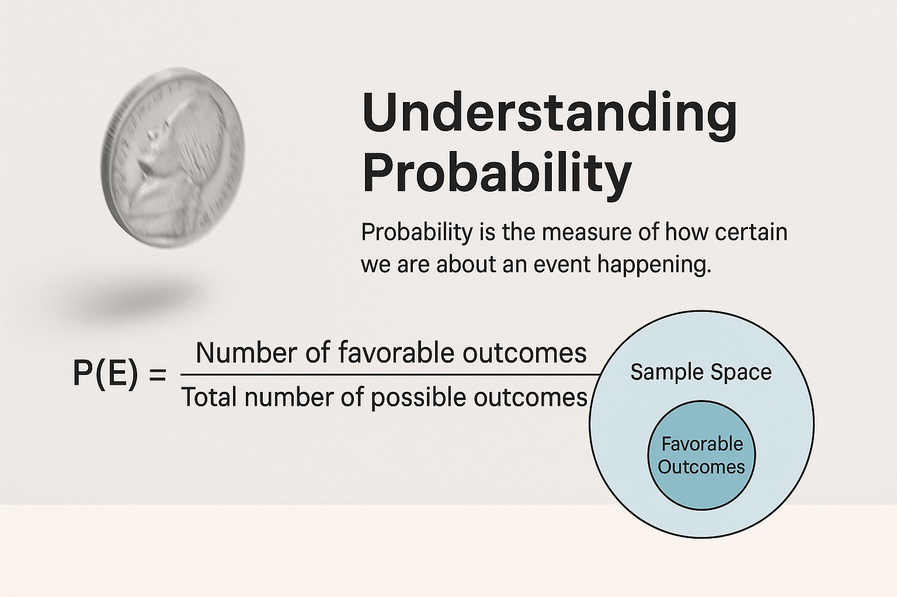

# Understanding Probability: From Everyday Life to Mathematics



> Probability is the measure of how certain we are about an event happening.

## 📖 Introduction
Have you ever:
- Checked the weather forecast before going out?
- Guessed the chances of your bus arriving on time?
- Tossed a coin to make a decision?

All of these involve **probability** — the science of measuring uncertainty.

## 🧠 What is Probability?
Mathematically:
```
P(E) = Number of favorable outcomes / Total number of possible outcomes
```

Example:
If you roll a fair die, the probability of getting a 4 is:
```
P(4) = 1/6 ≈ 0.167 (16.7%)
```

## 🌍 Types of Probability
- **Theoretical Probability** – Based on reasoning
- **Experimental Probability** – Based on experiments or trials
- **Subjective Probability** – Based on belief or experience

## 📌 Everyday Examples
1. Weather Forecasting
2. Sports Predictions
3. Medicine & Drug Trials
4. Finance & Risk Analysis

## 🎯 Quick Quiz
1. A bag has 5 red and 3 blue balls. Probability of picking blue?
2. Toss a die twice — probability of getting a 6 both times?

**Answers:**
1) 3/8
2) 1/36
